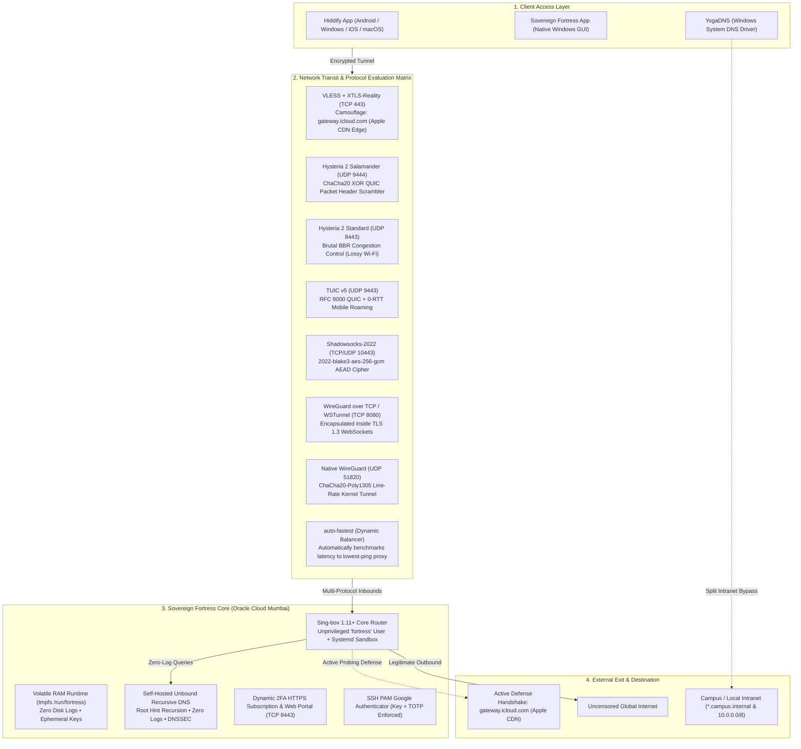
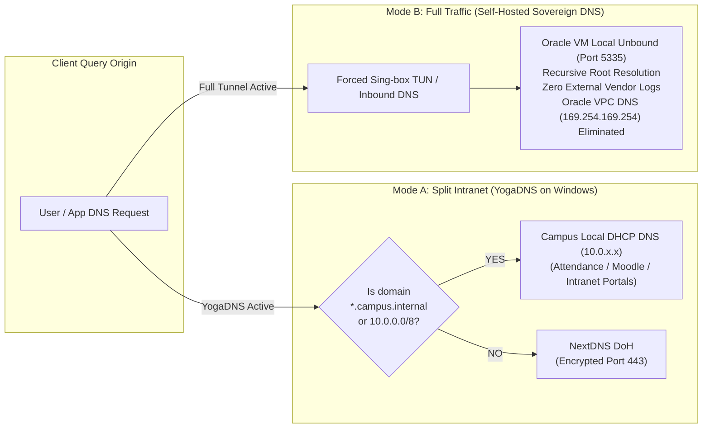
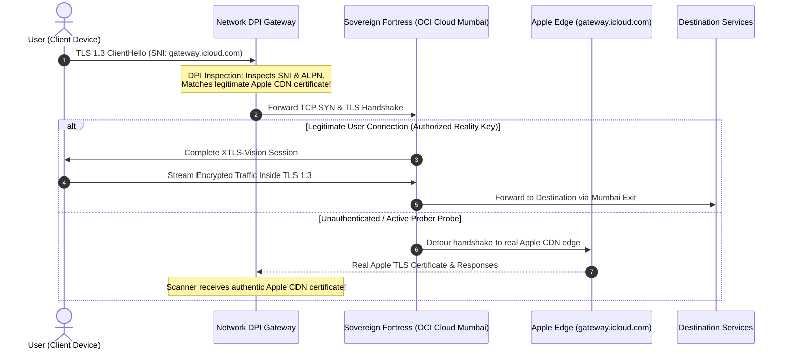

# Sovereign Fortress — Multi-Protocol Privacy & Transport Research Suite (2026)

[](https://github.com/harsh593-boop)
[](LICENSE)
[](LEGAL.md)
[](TERMS.md)
[](PRIVACY.md)
[](LEGAL.md)

A modern, sovereign, zero-log multi-protocol research testbed designed for studying encrypted transport protocols, measuring packet resilience over lossy wireless channels, evaluating zero-trust ephemeral memory architectures, and testing Let's Encrypt automated TLS integration.

> [!IMPORTANT]
> **Legal, Educational & Non-Circumvention Notice:**  
> This project is published **strictly for personal research, educational study, and protocol benchmarking**. The author **does not endorse, promote, or encourage the unauthorized circumvention of network security measures, firewalls, terms of service, or institutional codes of conduct**. All users are solely responsible for ensuring compliance with all local regulations and acceptable use policies. See [LEGAL.md](LEGAL.md) and [TERMS.md](TERMS.md) for complete details.

Runs 100% within the **Oracle Cloud Infrastructure (OCI) Always Free Tier ($0/month forever)**.

---

## 🏗️ System Architecture & Protocol Stack



---

## 🌐 Dual-Mode Zero-Leak DNS Architecture



---

## ⚡ Deep Packet Resilience & Adaptive Flow Architecture



---

## 🚀 Protocol Matrix & Performance Comparison

| Protocol Mode | Transport | Port | Congestion / Cipher | Resilience & Obfuscation Feature | Best Used For |
| :--- | :--- | :--- | :--- | :--- | :--- |
| **auto-fastest** | Auto | `Auto` | Dynamic Latency URLTest | Automatically benchmarks latency to all proxies and detours to lowest-ping route (labeled 'lowest' Balancer in Hiddify) | All-Round Best Experience |
| **VLESS + XTLS-Reality** | TCP | `443` | `xtls-rprx-vision` | Borrows authentic Apple TLS certs; active unauthenticated probers redirected to Apple CDN | Strict Edge & DPI Inspection |
| **Hysteria 2 Salamander** | UDP | `9444` | ChaCha20 XOR + BLAKE3 | Header scrambling makes QUIC unrecognizable to heuristics | Lossy / Throttled UDP Networks |
| **Hysteria 2 Standard** | UDP | `8443` | Brutal BBR over QUIC | High throughput on lossy wireless channels | High-Bitrate Streaming |
| **TUIC v5** | UDP | `9443` | RFC 9000 QUIC + BBR | 0-RTT handshake delay for instant reconnection | Mobile roaming (Wi-Fi ↔ 5G) |
| **Shadowsocks-2022** | TCP/UDP | `10443` | `2022-blake3-aes-256-gcm` | AEAD with variable-length packet padding | Minimal battery consumption |
| **WireGuard over TCP** | TCP | `8080` | TLS 1.3 WebSockets (`wstunnel`) | Wraps WireGuard inside HTTPS WebSockets | TCP-only egress environments |
| **Native WireGuard** | UDP | `51820` | ChaCha20-Poly1305 (Kernel) | Direct Linux kernel line-rate processing | High-speed unrestricted LAN |

---

## 📦 1-Click Server Installation

### Prerequisites
1. An **Oracle Cloud Infrastructure (OCI)** account (Always Free Tier).
2. An Ubuntu 22.04 / 24.04 VM instance (`VM.Standard.E2.1.Micro` or `VM.Standard.A1.Flex`).
3. Ingress Security Rules opened:
   - **TCP**: `22`, `443`, `8080`, `8443`, `10443`
   - **UDP**: `443`, `8443`, `9443`, `9444`, `10443`, `51820`

### Automated Deployment
On your fresh Ubuntu server, run:
```bash
git clone https://github.com/harsh593-boop/sovereign-fortress.git
cd sovereign-fortress
sudo bash deploy_server.sh
```

The automated installer will:
1. Create dedicated unprivileged system user `fortress` with minimal network binding capability (`CAP_NET_BIND_SERVICE`) and strict systemd sandboxing.
2. Mount a 256 MB volatile RAM disk (`tmpfs`) at `/run/fortress` for zero disk logs.
3. Install Sing-box 1.11.4 Core and WSTunnel with SHA-256 cryptographic verification.
4. Generate 100% unique, high-entropy cryptographic keys for all protocols (UUID, x25519 Reality keypairs, Hysteria 2 / Salamander passwords, Shadowsocks-2022 AEAD keys, WireGuard keypairs, and a 128-bit Master Subscription Token `ft_sec_...`).
5. Configure Unbound recursive zero-log DNS resolver on `127.0.0.1:5335`.
6. Configure Fail2ban intrusion defense and automatically generate a unique Google Authenticator RFC 6238 TOTP 2FA secret for SSH and the Web Portal.
7. Enforce strict firewall policies and disable IPv6 to prevent network leaks.
8. Launch the dynamic HTTPS subscription daemon and management portal on port `8443`.
9. Output your live HTTPS subscription URL, 2FA secret key, and generated `/etc/fortress/fortress_config.json`!

### Configuring Your 2FA Authenticator & Client App
When deployment finishes:
1. **Copy `/etc/fortress/fortress_config.json`** to your local machine as `fortress_config.json`.
2. **Register 2FA in Google Authenticator / Aegis / 2FAS**:
   * **In the Windows App**: Run `Launch Sovereign Fortress.bat` and click **`📱 2FA Setup QR`**. Scan the QR code or copy the secret key. The window displays a live 6-digit sync preview and countdown to confirm matching clocks!
   * **In the Web Portal**: Open `https://<YOUR_SERVER_IP>:8443/portal` in your browser. Enter your Master Token (`ft_sec_...`) to unlock the dashboard and scan the 2FA QR code.
   * **Via CLI**: Enter the `otpauth://...` URI or 32-character secret key printed at the end of `deploy_server.sh`.

### Generating / Rotating Secrets Manually (Optional)
If you ever want to generate your own unique tokens or rotate credentials independently:
```bash
# Generate a new 128-bit Master Subscription Token:
python3 -c "import secrets; print('ft_sec_' + secrets.token_hex(16))"

# Generate a new RFC 6238 Base32 2FA Secret Key:
python3 -c "import secrets, base64; print(base64.b32encode(secrets.token_bytes(20)).decode('utf-8').rstrip('='))"

# Generate a new VLESS UUIDv4:
python3 -c "import uuid; print(uuid.uuid4())"
```

### 🌐 Domain & Dynamic DNS (DDNS) Recommendations

To enable globally trusted HTTPS certificates via Let's Encrypt (eliminating TLS warnings and enabling seamless mobile app imports), a domain name pointing to your server IP is recommended:

| Option | Cost | Best For | SSL / TLS Provisioning | Notes |
| :--- | :--- | :--- | :--- | :--- |
| **DuckDNS** (`*.duckdns.org`) | **100% Free** | Quick setups, zero purchase required, dynamic VPS IPs | Let's Encrypt DNS-01 ACME challenge via DuckDNS API | Ideal for privacy research. An hourly cron job (`curl -s "https://www.duckdns.org/update?domains=YOUR_SUBDOMAIN&token=YOUR_TOKEN&ip="`) keeps the IP updated. |
| **Cloudflare DNS** (`custom domain`) | Free with own domain | Production deployments, root domains, vanity URLs | Certbot DNS-01 ACME via `certbot-dns-cloudflare` plugin | Set proxy status to **DNS Only (Grey Cloud)** so UDP and custom proxy ports are not filtered by Cloudflare edge reverse proxies. |
| **Direct Server IP** | **$0** | IP-only setups without domain registration | Self-Signed / Embedded Private CA | Supported out-of-the-box with embedded CA certificates, but requires trusting the CA on client devices. |


---

## 💻 Client Applications & Connections

### 1. Universal Hiddify App (Android, Windows, iOS, macOS)
1. Install **Hiddify** from [GitHub Releases](https://github.com/hiddify/hiddify-app/releases) or Google Play Store.
2. Click **+ Add Profile** &rarr; **Add from Clipboard** &rarr; paste your subscription URL:
   ```text
   https://<YOUR_SERVER_IP>:8443/sub/<YOUR_SUBSCRIPTION_TOKEN>
   ```
3. Tap **Connect**!

*Note on Hiddify UI Nodes & Balancers*:
* **`lowest` Balancer**: Maps directly to the Sing-box dynamic `urltest` group (`auto-fastest`). It continuously benchmarks real-time latency across all available proxies and dynamically routes through the lowest-ping connection.
* **`balance` Balancer**: Maps to the Sing-box master `proxy` selector group.
* **Individual Protocol Nodes**: Directly underneath the two balancers, all 6 mobile-compatible stealth protocol nodes (`Fortress-Reality-TCP`, `Fortress-Hysteria2-Salamander`, `Fortress-Hysteria2-Standard`, `Fortress-TUIC5`, `Fortress-Shadowsocks2022`, and `Fortress-WireGuard-Native`) appear with clean labels matching the Web Portal 1:1.
* **`Fortress-WireGuard-TCP`**: Uses `wstunnel` over WebSockets (TCP 8080) for Windows desktop CLI environments (`start-wstunnel.bat`).

### 2. Native Windows Desktop Application
Launch `Launch Sovereign Fortress.bat` (or run `SovereignFortressApp.pyw`):
* Dark-mode control center with real-time protocol port reachability and status indicators.
* **`📱 2FA Setup QR`**: Native on-screen 2FA registration popup with live sync verification.
* **`📲 Mobile Sub QR`**: Scan directly with phone camera to import all 7 protocols into Hiddify.
* **`⚡ Launch Hiddify`**: 1-Click launcher with clipboard auto-copy.
* Local DPAPI credential protection (`fortress_vault.py lock`) and emergency overwrite panic switch (`fortress_vault.py shred`).

### 3. YogaDNS Setup (for Campus Wi-Fi)
See [`yogadns_rules.md`](yogadns_rules.md) for full step-by-step instructions:
* **Rule 1 (Campus Intranet Bypass):** `*.campus.internal` & `10.*` &rarr; `System Default` (Campus DHCP DNS).
* **Rule 2 (General Encrypted DNS):** `*` &rarr; NextDNS DoH (`https://dns.nextdns.io/<YOUR_NEXTDNS_ID>`) or Self-Hosted Sovereign DNS.

---

## 🔐 Zero-Trust & Hardened Protections

* **SSH 2FA (Google Authenticator via PAM):** Key-only access is rejected. Server requires both the SSH Key and a live 6-digit TOTP code.
* **Fail2ban Intrusion Defense:** Enforces jail on SSH port 22 with automatic IP bans for repeated failed attempts.
* **Least-Privilege Execution:** Sing-box and subscription daemons run as dedicated unprivileged system user `fortress` with strict systemd sandboxing.
* **1-Click Token Revocation:** Instantly kills leaked subscription links in volatile RAM.
* **Dynamic 2FA Subscription:** Append your live 6-digit TOTP code (`/sub/<TOTP>`) to fetch profiles on demand with a 30-second expiry.
* **Active Defense Camouflage:** Unauthorized requests automatically detour to Apple CDN edge.
* **Volatile RAM Runtime:** Active tokens, certificates, and runtime sessions operate in `/run/fortress` (`tmpfs`); master persistent templates in `/etc/fortress` are secured with `chmod 700` and `chmod 600`.
* **Client DPAPI Protection:** Local keys encrypted at rest using Windows user-bound DPAPI (`CryptProtectData`).
* **Emergency Panic Switch:** Multi-pass file overwriting and cryptographic key erasure on local working files.

---

## 🛡️ Full Disk Encryption (FDE) & Cryptographic Zeroization

Sovereign Fortress implements a four-tier defense-in-depth cryptographic storage model protecting against physical seizure, raw hypervisor disk inspection, forensic data recovery, and local drive duplication:

### 1. Hardware Full Disk Encryption at Rest (OCI Block Volume AES-256)
* **Underlying Storage Encryption**: 100% of all data written to Oracle Cloud Infrastructure Block Volumes (including the root filesystem `/dev/sda` / `/dev/mapper/root`, boot volume, and swap space) is automatically and transparently encrypted at rest with hardware-accelerated **AES-256** encryption before committing to physical flash/NVMe media.
* **FIPS 140-2 Level 2 Cryptographic Validation**: Encryption keys are generated, rotated, and managed in compliance with federal security standards. Even in catastrophic breach scenarios involving raw hardware detachment, storage array theft, or unauthorized cloud hypervisor volume snapshots, data on disk consists solely of high-entropy ciphertext indistinguishable from random noise.

### 2. Ephemeral Volatile RAM Runtime (`/run/fortress` tmpfs)
* **Zero Disk Footprint**: All sensitive runtime assets—including active subscription authentication tokens (`sub_token`), TOTP seeds (`totp_secret`), WireGuard private keys (`wg_client_priv`, `wg_server_priv`), TLS certificates and keys (`cert.pem`, `key.pem`), and Sing-box routing tables—are hosted exclusively in a kernel-managed volatile RAM disk (`tmpfs`) mounted at `/run/fortress`.
* **Zero Forensic Disk Logging**: Systemd journal buffers for Sovereign Fortress services run with `Storage=volatile`, and sing-box logging is constrained to `warn`. No plaintext connection history, DNS queries, client IPs, or destination metrics are ever committed to non-volatile disk storage.
* **Instant Cryptographic Zeroization on Power Loss**: RAM cells require continuous electric refresh. The instant the server instance is rebooted, terminated, or loses power, all volatile RAM charges dissipate in sub-seconds, physically and irrevocably obliterating all cryptographic session keys and access tokens.

### 3. Client-Side Cryptographic Vault & Windows DPAPI
* **Windows DPAPI (`Protect-FortressVault.ps1`)**: On the local client machine, all connection profiles, subscription links, and TOTP secrets are encrypted using Windows Cryptographic Data Protection API (`CryptProtectData` with `DataProtectionScope.CurrentUser`).
* **Machine & User Session Entropy**: Vault ciphertexts are cryptographically bound using secondary entropy derived from user identity, computer name, and static salt. Offline drive cloning, cold disk extraction, or rogue processes in other user sessions cannot decrypt the credentials without access to the authenticated user's Windows session. (Note: As standard with user-scoped DPAPI, processes executing within the active user logon session can unprotect vault data; it is not hardware PCR-sealed to a TPM).

### 4. Emergency Anti-Forensic Panic Switch (`Shred-Fortress.ps1`)
* **Multi-Pass DOD 5220.22-M Overwrite**: In extreme threat environments, running `Shred-Fortress.ps1` executes pseudo-random cryptographic bit overwrites across all sensitive client files before physical file unlinking, preventing SSD/HDD forensic file carving.

---

---

## 🤖 Autonomous AI Engineering Disclosure

> [!NOTE]
> **Notice of AI-Synthesized Code & Architecture:**
> 100% of this repository—including network architectural designs, encrypted transport routing logic, Sing-box schema definitions, bash deployment automation, Python daemons, Windows PowerShell security scripts, and documentation—was researched, planned, generated, coded, and verified using **Autonomous Agentic Artificial Intelligence (Antigravity AI Agent)** operating under the creative direction, requirements, testing supervision, and compilation of **[harsh593-boop](https://github.com/harsh593-boop)**.

---

## ⚖️ Absolute Disclaimer of Liability & Risk Assumption

> [!WARNING]
> **USE AT YOUR OWN RISK — NO LIABILITY OR RESPONSIBILITY ACCEPTED:**
> This repository and all associated files are published strictly for **academic research, educational analysis, and security auditing purposes**.
> 
> The project maintainer (**harsh593-boop**) and the underlying AI systems **assume zero responsibility or liability** for how this software or any generated configuration is used, deployed, modified, or operated. Specifically:
> 1. **Zero Legal or Regulatory Responsibility:** The author is not responsible for any compliance failures, regulatory infractions, civil claims, or criminal consequences under any nation's telecommunications, cybersecurity, encryption, or national security laws. It is solely your duty to ensure that running network tunnels, proxies, or encryption software complies with all applicable local, institutional, and regional regulations.
> 2. **Zero Financial or Service Liability:** The author is not liable for any cloud hosting fees, unexpected bandwidth overages, Oracle Cloud account suspensions, IP reputation blacklisting, or local network disciplinary actions.
> 3. **"As-Is" Software with Zero Warranty:** All code and scripts are provided on an *"AS IS"* and *"AS AVAILABLE"* basis without warranty of any kind. The author assumes no liability for software bugs, logic flaws, network outages, data loss, security vulnerabilities, or unintended operational downtime resulting from AI-generated code.
> 
> **By cloning, downloading, viewing, or deploying this repository, you irrevocably agree that you act entirely at your own risk and hold harsh593-boop completely harmless and indemnified from all claims and consequences.**

---

## 👤 Author & Copyright Holder
Conceived, directed, prompted, curated, and maintained by **[harsh593-boop](https://github.com/harsh593-boop)**.

---

## 📄 License & Proprietary Copyright Notice

**Copyright (c) 2026 harsh593-boop. All Rights Reserved.**

This software is released under a **Proprietary Source-Available License**:
* **Human Authorship & Compilation Rights:** All selection, curation, architectural arrangement, and compilation copyright remain exclusively vested in **harsh593-boop**.
* **Personal & Security Evaluation Use:** You are granted the right to inspect, audit, evaluate, and deploy Sovereign Fortress solely for private, non-commercial, personal telecommunications research and security evaluation.
* **Strict Commercial Prohibition:** Commercial use, SaaS/PaaS resale, managed VPN hosting, monetization, or unauthorized redistribution in source or binary form is **strictly prohibited** without explicit, prior written permission signed by **harsh593-boop**.
* **Statutory Enforcement & Treaty Rights:** Full statutory rights reserved under the **Indian Copyright Act, 1957**, the **United States Digital Millennium Copyright Act (DMCA, 17 U.S.C. § 512)**, and international copyright conventions (Berne Convention, WIPO Copyright Treaty). Unauthorized distribution or commercial exploitation will result in immediate DMCA takedown actions and legal statutory damages.
* For licensing inquiries, commercial permissions, or custom enterprise deployments, contact the author via [GitHub Issues / Discussion](https://github.com/harsh593-boop/sovereign-fortress).
