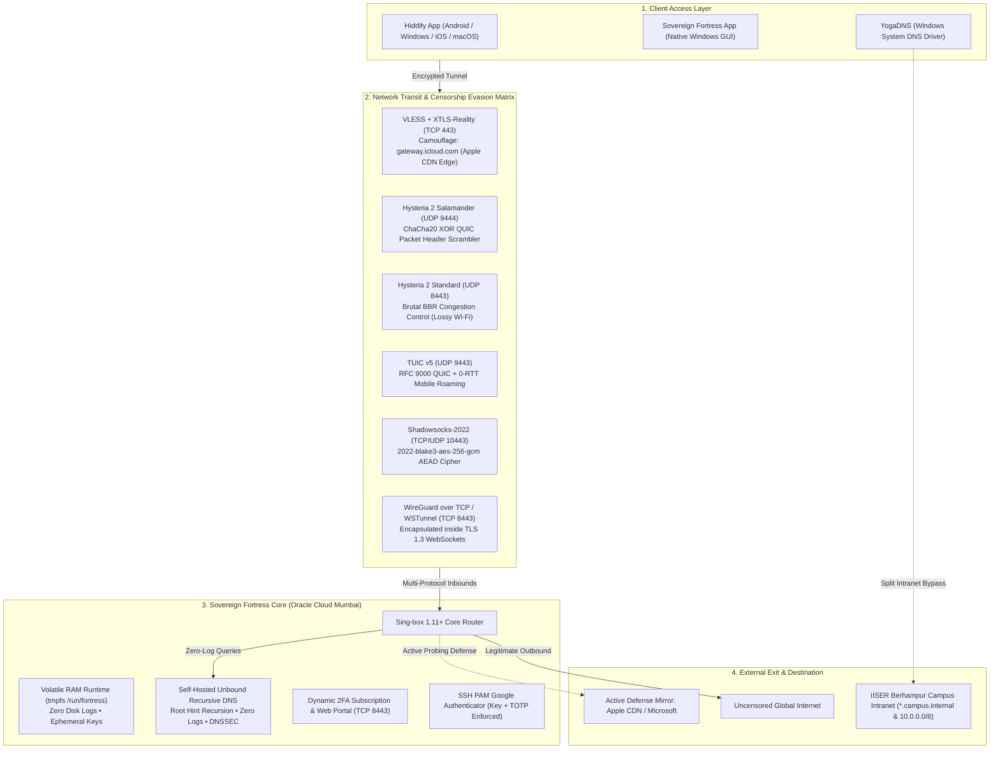
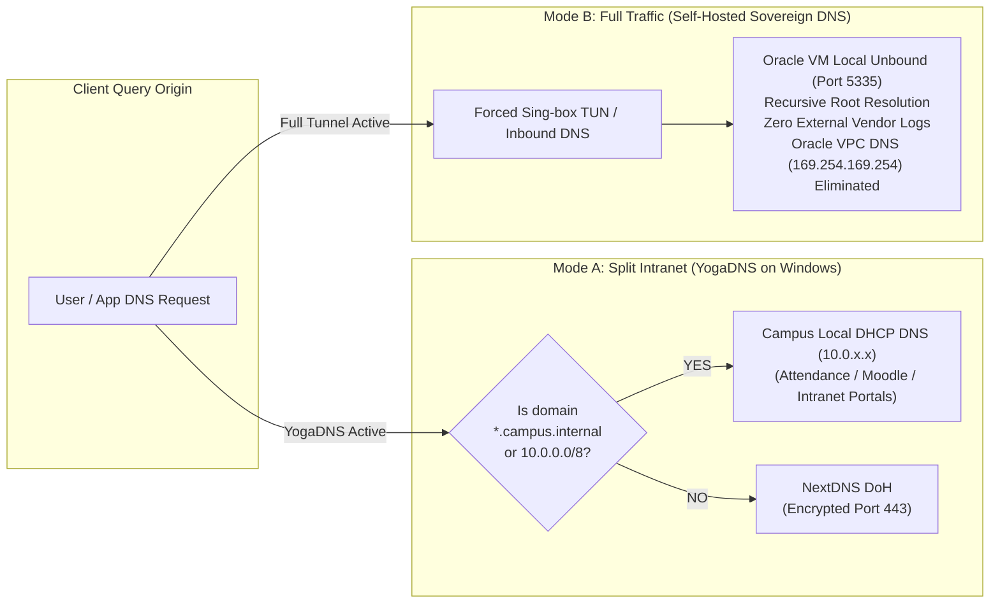
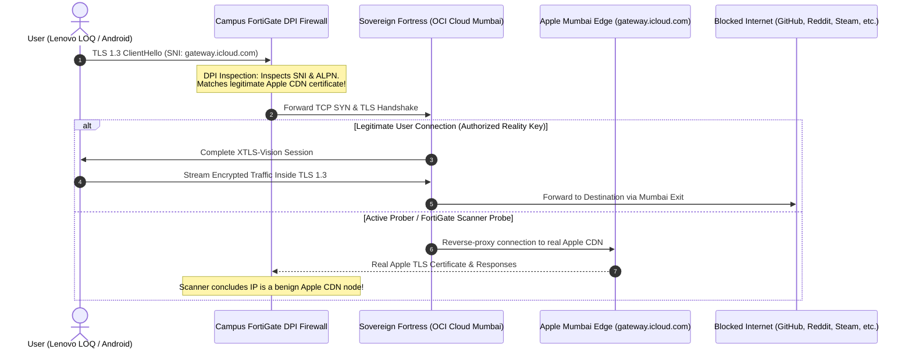

# Sovereign Fortress — Multi-Protocol Anti-Censorship & Zero-Trust VPN Suite (2026)

[](https://github.com/harsh593-boop)
[](https://opensource.org/licenses/MIT)
[]()
[]()
[]()
[]()

A modern, sovereign, zero-log multi-protocol VPN and proxy architecture designed to defeat severe network censorship, deep packet inspection (DPI), active probing, captive portals, and nation-state firewalls (GFW, Fortinet FortiGate, RKN).

Runs 100% within the **Oracle Cloud Infrastructure (OCI) Always Free Tier ($0/month forever)**.

---

## 🏗️ System Architecture & Defense Stack



---

## 🌐 Dual-Mode Zero-Leak DNS Architecture



---

## ⚡ Fortinet FortiGate DPI Evasion Flow



---

## 🚀 Censorship Evasion Protocol Comparison

| Protocol Mode | Transport | Port | Congestion / Cipher | Anti-Censorship Superpower | Best Used For |
| :--- | :--- | :--- | :--- | :--- | :--- |
| **VLESS + XTLS-Reality** | TCP | `443` | `xtls-rprx-vision` | Borrows real Apple TLS certs; active probers redirected to Apple CDN | Strict DPI & Firewalls |
| **Hysteria 2 Salamander** | UDP | `9444` | ChaCha20 XOR + BLAKE3 | Header scrambling makes QUIC unrecognizable to heuristics | UDP throttling / QUIC drop |
| **Hysteria 2 Standard** | UDP | `8443` | Brutal BBR over QUIC | Up to 1 Gbps throughput on lossy campus Wi-Fi | 4K Streaming & Gaming |
| **TUIC v5** | UDP | `9443` | RFC 9000 QUIC + BBR | 0-RTT handshake delay for instant reconnection | Mobile roaming (Wi-Fi ↔ 5G) |
| **Shadowsocks-2022** | TCP/UDP | `10443` | `2022-blake3-aes-256-gcm` | AEAD with variable-length packet padding | Minimal battery consumption |
| **WireGuard over TCP** | TCP | `8443` | TLS 1.3 WebSockets (`wstunnel`) | Wraps WireGuard inside HTTPS WebSockets | Captive portals blocking UDP |
| **Native WireGuard** | UDP | `51820` | ChaCha20-Poly1305 (Kernel) | Direct Linux kernel line-rate processing | High-speed unrestricted LAN |

---

## 📦 1-Click Server Installation

### Prerequisites
1. An **Oracle Cloud Infrastructure (OCI)** account (Always Free Tier).
2. An Ubuntu 22.04 / 24.04 VM instance (`VM.Standard.E2.1.Micro` or `VM.Standard.A1.Flex`).
3. Ingress Security Rules opened:
   - **TCP**: `22`, `443`, `8443`, `10443`
   - **UDP**: `443`, `8443`, `9443`, `9444`, `10443`, `51820`

### Automated Deployment
On your fresh Ubuntu server, run:
```bash
git clone https://github.com/harsh593-boop/sovereign-fortress.git
cd sovereign-fortress
sudo bash deploy_server.sh
```

The automated installer will:
1. Mount a 256 MB volatile RAM disk (`tmpfs`) at `/run/fortress` for anti-forensic security.
2. Install Sing-box 1.11+ Core and the Unbound recursive zero-log DNS resolver.
3. Configure Google Authenticator PAM 2FA for SSH.
4. Launch the dynamic subscription daemon and management portal on port `8443`.
5. Output your live subscription URL and QR codes!

---

## 💻 Client Applications & Connections

### 1. Universal Hiddify App (Android, Windows, iOS, macOS)
1. Install **Hiddify** from [GitHub Releases](https://github.com/hiddify/hiddify-app/releases) or Google Play Store.
2. Click **+ Add Profile** &rarr; **Add from Clipboard** &rarr; paste your subscription URL:
   ```text
   http://<YOUR_SERVER_IP>:8443/sub/<YOUR_SUBSCRIPTION_TOKEN>
   ```
3. Tap **Connect**!

### 2. Native Windows Desktop Application
Launch `Launch Sovereign Fortress.bat` (or run `SovereignFortressApp.pyw`):
* Dark-mode control center with real-time protocol latency and port status indicators.
* 1-Click import into Hiddify.
* Integrated Web Portal and QR Code launcher.
* Local DPAPI credential protection (`Protect-FortressVault.ps1`) and emergency cryptoshredding panic switch (`Shred-Fortress.ps1`).

### 3. YogaDNS Setup (for Campus Wi-Fi)
See [`yogadns_rules.md`](yogadns_rules.md) for full step-by-step instructions:
* **Rule 1 (Campus Intranet Bypass):** `*.campus.internal` & `10.*` &rarr; `System Default` (Campus DHCP DNS).
* **Rule 2 (General Encrypted DNS):** `*` &rarr; NextDNS DoH (`https://dns.nextdns.io/<YOUR_NEXTDNS_ID>`) or Self-Hosted Sovereign DNS.

---

## 🔐 Zero-Trust & Anti-Forensic Protections

* **SSH 2FA (Google Authenticator via PAM):** Key-only access is rejected. Server requires both the SSH Key and a live 6-digit TOTP code.
* **1-Click Token Revocation:** Instantly kills leaked subscription links in volatile RAM.
* **Dynamic 2FA Subscription:** Append your live 6-digit TOTP code (`/sub/<TOTP>`) to fetch profiles on demand with a 30-second expiry.
* **Active Defense Decoy:** Unauthorized requests automatically redirect (HTTP 302) to `https://www.apple.com/`.
* **Zero Disk Logs:** All active tokens and certificates reside in `/run/fortress` on volatile `tmpfs`.
* **Remote Panic Switch:** A single trigger executes multi-pass cryptoshredding (`shred -u -z -n 3`) on RAM and disk templates before poweroff.

---

## 👤 Author
Developed and maintained by **[harsh593-boop](https://github.com/harsh593-boop)**.

## 📄 License
This project is licensed under the MIT License — see the [LICENSE](LICENSE) file for details.
