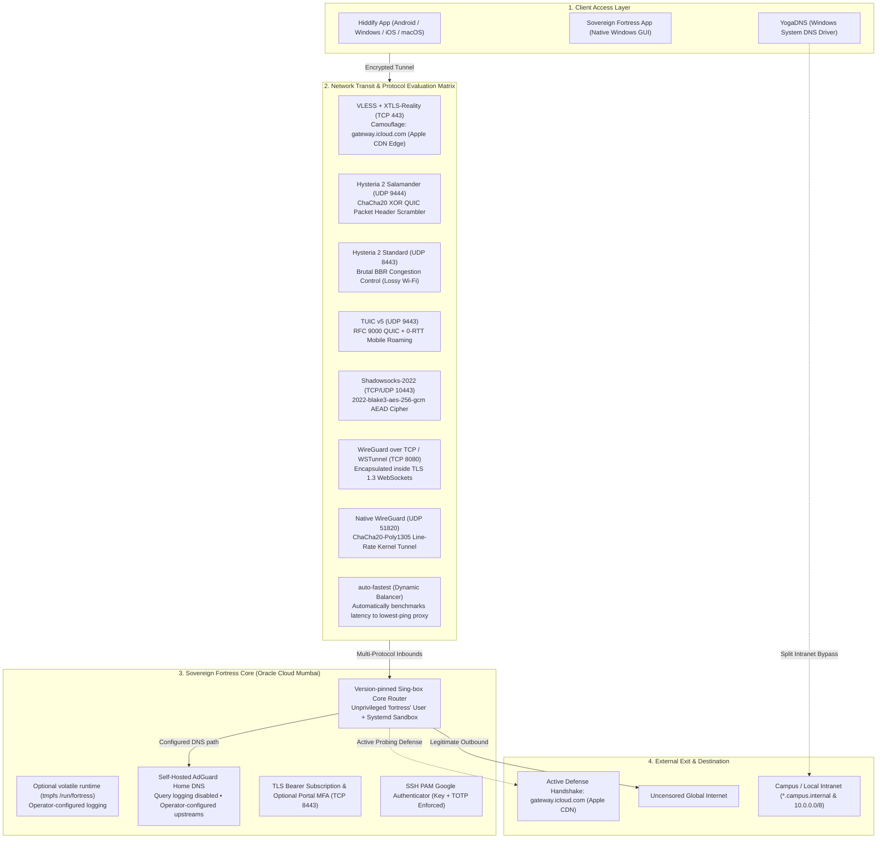
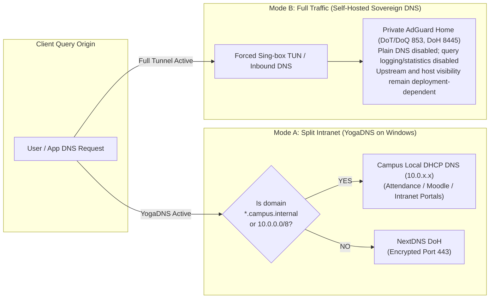
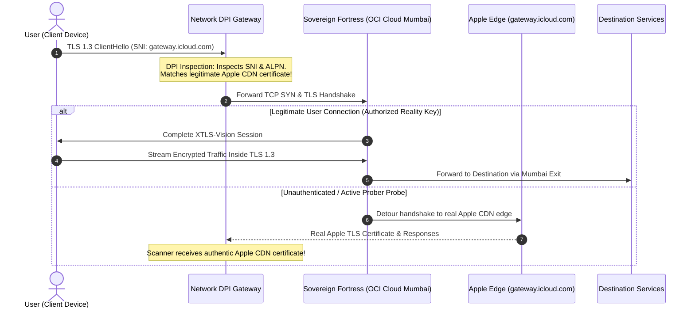

# Sovereign Fortress — Multi-Protocol Privacy & Transport Research Suite (2026)

[](https://github.com/harsh593-boop)
[](LICENSE)
[](LEGAL.md)
[](TERMS.md)
[](PRIVACY.md)
[](LEGAL.md)

A multi-protocol research testbed for studying encrypted transport protocols, measuring packet resilience over lossy wireless channels, evaluating ephemeral-memory designs, and testing Let's Encrypt automated TLS integration. Privacy and logging behavior remain deployment- and provider-dependent; see [PRIVACY.md](PRIVACY.md).

> [!WARNING]
> **Not production-ready.** The installer refuses existing deployments. Use
> reviewed, backed-up migrations instead. Client software may rewrite imported
> DNS/TUN rules, and there is no verified persistent Windows kill switch.
> Traffic-only mode does not guarantee that arbitrary OS, browser, or app DNS
> exits locally. Do not deploy or distribute profiles until exposed secrets are
> rotated and packet-level IPv4/IPv6/DNS/WebRTC/failure tests pass.

> [!IMPORTANT]
> **Legal, Educational & Non-Circumvention Notice:**
> This project is published **strictly for personal research, educational study, and protocol benchmarking**. The author **does not endorse, promote, or encourage the unauthorized circumvention of network security measures, firewalls, terms of service, or institutional codes of conduct**. All users are solely responsible for ensuring compliance with all local regulations and acceptable use policies. See [LEGAL.md](LEGAL.md) and [TERMS.md](TERMS.md) for complete details.

Can be evaluated on an OCI VM. Pricing, eligibility, bandwidth limits, and service availability are provider-dependent—not guaranteed by this project.

## Current verification and supported profiles

See [SECURITY_REVIEW.md](SECURITY_REVIEW.md) for evidence and open release gates.
Current application-core migration/recovery, encrypted DNS, automatic-update
policy, and provider-authority steps are in [HOST_MAINTENANCE.md](HOST_MAINTENANCE.md);
read-only Windows readiness and required administrator/packet-testing gates are in
[WINDOWS_NETWORK_READINESS.md](WINDOWS_NETWORK_READINESS.md).
The subscription defaults to **Sing-box 1.14** syntax. Request `&core=1.11`
explicitly for the validated legacy 1.11.4 profile. The public JSON examples
are **1.14** templates; do not load them unchanged into a 1.11 or 1.13 core.
Hiddify may import only proxy nodes and regenerate routing/DNS; a successful
import is not proof that either operating mode was preserved.

Full-Tunnel and Traffic-Only both use TUN in the reference profiles. Traffic-Only
means intended local DNS egress alongside tunneled payload traffic, **not**
system-proxy-only mode. Full-Tunnel routes DNS to AdGuard Home on the VPS (`10.8.0.1:5335` plain UDP DNS)
encapsulated inside the encrypted proxy tunnel (`detour: proxy`), delivering instant 0-RTT speed
without double-TLS overhead. Standalone users can connect directly to encrypted DNS over WAN without running any VPN:
**DoT** (port 853 TCP, Android Private DNS: `<domain>`), **DoQ** (port 853 UDP), **DoH** (port 8445 TCP),
and **DNSCrypt v2** (port 5443 TCP/UDP with RFC-compliant `sdns://...` stamps exportable in the portal).
AdGuard caching is tuned with optimistic prefetching, 4MB cache, and parallel upstream resolution.

Private Windows client files belong under `%LOCALAPPDATA%\\SovereignFortress`,
not the public checkout. The GUI can load a user-bound DPAPI `.enc` config
without writing a plaintext copy. `FORTRESS_CLIENT_HOME` and
`FORTRESS_CLIENT_CONFIG` provide explicit overrides. See [client paths](client_paths.py).

Checks:

```bash
PYTHONDONTWRITEBYTECODE=1 python3 -m unittest discover -s tests -v
python3 comprehensive_verification.py --offline
bash -n deploy_server.sh fortress-init.sh
shellcheck deploy_server.sh fortress-init.sh
python3 validate_profiles.py --legacy /path/to/sing-box-1.11.4 --current /path/to/sing-box-1.14.2
python3 check_repo_privacy.py
# Optional per-repository commit guard:
git config core.hooksPath .githooks
```

Live checks are explicit opt-ins: `server_smoke_checks.py` runs on the VPS as
root; `probe_proxy_transports.py` uses a protected private profile and proves
only selected proxy connectivity. The old live verifiers are archival, gated
by `--legacy-live`, and must not be used as release evidence.

---

## 🏗️ System Architecture & Protocol Stack


```mermaid
flowchart TD
    subgraph ClientLayer["1. Client Access Layer"]
        Hiddify["Hiddify App (Android / Windows / iOS / macOS)"]
        NativeApp["Sovereign Fortress App (Native Windows GUI)"]
        YogaDNS["YogaDNS (Windows System DNS Driver)"]
    end

    subgraph DefenseGrid["2. Network Transit & Protocol Evaluation Matrix"]
        Reality["VLESS + XTLS-Reality (TCP 443)\nCamouflage: gateway.icloud.com (Apple CDN Edge)"]
        Salamander["Hysteria 2 Salamander (UDP 9444)\nChaCha20 XOR QUIC Packet Header Scrambler"]
        Hy2Std["Hysteria 2 Standard (UDP 8443)\nBrutal BBR Congestion Control (Lossy Wi-Fi)"]
        TUIC["TUIC v5 (UDP 9443)\nRFC 9000 QUIC + 0-RTT Mobile Roaming"]
        Shadowsocks["Shadowsocks-2022 (TCP/UDP 10443)\n2022-blake3-aes-256-gcm AEAD Cipher"]
        WSTunnel["WireGuard over TCP / WSTunnel (TCP 8080)\nEncapsulated inside TLS 1.3 WebSockets"]
        NativeWG["Native WireGuard (UDP 51820)\nChaCha20-Poly1305 Line-Rate Kernel Tunnel"]
        AutoFast["auto-fastest (Dynamic Balancer)\nAutomatically benchmarks latency to lowest-ping proxy"]
    end

    subgraph CoreEngine["3. Sovereign Fortress Core (Oracle Cloud Mumbai)"]
         RAMFS["Optional volatile runtime (tmpfs /run/fortress)\nOperator-configured logging"]
        Singbox["Version-pinned Sing-box Core Router\nUnprivileged 'fortress' User + Systemd Sandbox"]
         AdGuard["Self-Hosted AdGuard Home DNS\nQuery logging disabled • Operator-configured upstreams"]
        SubDaemon["TLS Bearer Subscription & Optional Portal MFA (TCP 8443)"]
        PAM2FA["SSH PAM Google Authenticator (Key + TOTP Enforced)"]
    end

    subgraph InternetExit["4. External Exit & Destination"]
        Decoy["Active Defense Handshake: gateway.icloud.com (Apple CDN)"]
        PublicWeb["Uncensored Global Internet"]
        CampusLAN["Campus / Local Intranet (*.campus.internal & 10.0.0.0/8)"]
    end

    ClientLayer -->|Encrypted Tunnel| DefenseGrid
    YogaDNS -.->|Split Intranet Bypass| CampusLAN
    DefenseGrid -->|Multi-Protocol Inbounds| Singbox
     Singbox -->|Configured DNS path| AdGuard
    Singbox -->|Legitimate Outbound| PublicWeb
    Singbox -.->|Active Probing Defense| Decoy
```

---

## 🌐 Dual-Mode DNS Architecture (Verification Required)


```mermaid
flowchart LR
    subgraph QueryOrigin["Client Query Origin"]
        AppQuery["User / App DNS Request"]
    end

    subgraph ModeA["Mode A: Split Intranet (YogaDNS on Windows)"]
        IntranetMatch{"Is domain\n*.campus.internal\nor 10.0.0.0/8?"}
        CampusDNS["Campus Local DHCP DNS (10.0.x.x)\n(Attendance / Moodle / Intranet Portals)"]
        YogaDoH["NextDNS DoH\n(Encrypted Port 443)"]
    end

    subgraph ModeB["Mode B: Full Traffic (Self-Hosted Sovereign DNS)"]
        TunnelDNS["Forced Sing-box TUN / Inbound DNS"]
        LocalAdGuard["Private AdGuard Home (DoT/DoQ 853, DoH 8445)\nPlain DNS disabled; query logging/statistics disabled\nUpstream and host visibility remain deployment-dependent"]
    end

    AppQuery -->|YogaDNS Active| IntranetMatch
    IntranetMatch -->|YES| CampusDNS
    IntranetMatch -->|NO| YogaDoH

    AppQuery -->|Full Tunnel Active| TunnelDNS
    TunnelDNS --> LocalAdGuard
```

---

## ⚡ Deep Packet Resilience & Adaptive Flow Architecture


```mermaid
sequenceDiagram
    autonumber
    actor User as User (Client Device)
    participant Gateway as Network DPI Gateway
    participant Fortress as Sovereign Fortress (OCI Cloud Mumbai)
    participant Apple as Apple Edge (gateway.icloud.com)
    participant Target as Destination Services

    User->>Gateway: TLS 1.3 ClientHello (SNI: gateway.icloud.com)
    Note over Gateway: DPI Inspection: Inspects SNI & ALPN.<br/>Matches legitimate Apple CDN certificate!
    Gateway->>Fortress: Forward TCP SYN & TLS Handshake
    alt Legitimate User Connection (Authorized Reality Key)
        Fortress->>User: Complete XTLS-Vision Session
        User->>Fortress: Stream Encrypted Traffic Inside TLS 1.3
        Fortress->>Target: Forward to Destination via Mumbai Exit
    else Unauthenticated / Active Prober Probe
        Fortress->>Apple: Detour handshake to real Apple CDN edge
        Apple-->>Gateway: Real Apple TLS Certificate & Responses
        Note over Gateway: Scanner receives authentic Apple CDN certificate!
    end
```

---

## 🚀 Protocol Matrix & Performance Comparison

| Protocol Mode | Transport | Port | Congestion / Cipher | Resilience & Obfuscation Feature | Best Used For |
| :--- | :--- | :--- | :--- | :--- | :--- |
| **auto-fastest** | Auto | `Auto` | Dynamic Latency URLTest | Automatically benchmarks latency to all proxies and detours to lowest-ping route (labeled 'lowest' Balancer in Hiddify) | All-Round Best Experience |
| **VLESS + XTLS-Reality** | TCP | `443` | `xtls-rprx-vision` | Borrows authentic Apple TLS certs; active unauthenticated probers redirected to Apple CDN | Strict Edge & DPI Inspection |
| **Hysteria 2 Salamander** | UDP | `9444` | ChaCha20 XOR + BLAKE3 | Header scrambling makes QUIC unrecognizable to heuristics | Lossy / Throttled UDP Networks |
| **Hysteria 2 Standard** | UDP | `8443` | Brutal BBR over QUIC | High throughput on lossy wireless channels | High-Bitrate Streaming |
| **TUIC v5** | UDP | `9443` | RFC 9000 QUIC + BBR | 0-RTT handshake delay for instant reconnection | Mobile roaming (Wi-Fi ↔ 5G) |
| **Shadowsocks-2022** | TCP/UDP | `10443` | `2022-blake3-aes-256-gcm` | AEAD with variable-length packet padding | Minimal battery consumption |
| **WireGuard over TCP** | TCP | `8080` | TLS 1.3 WebSockets (`wstunnel`) | Wraps WireGuard inside HTTPS WebSockets | TCP-only egress environments |
| **Native WireGuard** | UDP | `51820` | ChaCha20-Poly1305 (Kernel) | Direct Linux kernel line-rate processing | High-speed unrestricted LAN |

---

## 📦 1-Click Server Installation

### Prerequisites
1. An **Oracle Cloud Infrastructure (OCI)** account (Always Free Tier).
2. An Ubuntu 22.04 / 24.04 VM instance (`VM.Standard.E2.1.Micro` or `VM.Standard.A1.Flex`).
3. Ingress Security Rules opened:
   - **TCP**: `22`, `443`, `8080`, `8443`, `10443`
   - **UDP**: `443`, `8443`, `9443`, `9444`, `10443`, `51820`

### Automated Deployment
On your fresh Ubuntu server, run:
```bash
git clone https://github.com/harsh593-boop/sovereign-fortress.git
cd sovereign-fortress
# Fresh disposable VM only; replace these public placeholders.
sudo env FORTRESS_SERVER_IP='<YOUR_SERVER_IP>' \
  FORTRESS_DOMAIN='<YOUR_TLS_SERVER_NAME>' \
  FORTRESS_AGH_SHA256='<VERIFIED_PINNED_ARCHIVE_SHA256>' \
  bash deploy_server.sh
```

The automated installer will:
1. Create dedicated unprivileged system user `fortress` with minimal network binding capability (`CAP_NET_BIND_SERVICE`) and strict systemd sandboxing.
2. Optionally mount a 256 MB volatile RAM disk (`tmpfs`) at `/run/fortress` for selected runtime state; verify host logging separately.
3. Install pinned Sing-box 1.14.2 Core and WSTunnel with SHA-256 cryptographic verification.
4. Generate 100% unique, high-entropy cryptographic keys for all protocols (UUID, x25519 Reality keypairs, Hysteria 2 / Salamander passwords, Shadowsocks-2022 AEAD keys, WireGuard keypairs, and a 128-bit Master Subscription Token `ft_sec_...`).
5. Configure AdGuard Home with standalone and in-tunnel encrypted DNS: DoT/DoQ (port 853), DoH (port 8445), and DNSCrypt v2 (port 5443); WAN plain DNS (port 5335) is dropped by firewall policies, while encrypted resolvers are protected by TLS 1.3 / Perfect Forward Secrecy.
6. Leave SSH authentication unchanged by default. SSH/PAM changes require explicit `FORTRESS_CONFIGURE_SSH_2FA=1`, an enrolled `FORTRESS_ADMIN_USER`, and verified recovery access. Portal TOTP is separate and opt-in; never reuse the SSH seed.
7. Enforce strict firewall policies and disable IPv6 to prevent network leaks.
8. Launch the dynamic HTTPS subscription daemon and management portal on port `8443`.
9. Write deployment credentials to the operator-controlled `/etc/fortress/fortress_config.json`; protect and transfer them out-of-band.

### Configuring Your 2FA Authenticator & Client App
Keep deployment configuration and profiles outside the checkout. On Windows,
store them in the restricted private client directory and protect them with
`fortress_vault.py` or `install_client_bundle.py`. Neither the installer nor
checks should print tokens or enrollment seeds.

The portal requires the confidential token. Optional `portal_totp_required: true`
requires **both** that token and a separately enrolled seed stored at
`/var/lib/fortress/subscription/portal_totp_secret`; enroll it privately before
enabling the flag in the runtime/persistent config. Standalone OTP subscription
URLs are retired. SSH/PAM enrollment remains separate and is not exported.

The GUI is a control/dashboard helper—not a verified VPN service or kill switch.
Unlocking profiles creates private plaintext files until you lock them again.
For the native 1.14 client, validate the decrypted profile with `sing-box check`
before requesting elevation to run TUN. Do not run two TUN clients simultaneously.
No root-CA installation is needed for a publicly trusted server certificate;
a private CA requires independent fingerprint verification and explicit consent.

### Generating / Rotating Secrets Manually (Optional)
If you ever want to generate your own unique tokens or rotate credentials independently:
```bash
# Generate a new 128-bit Master Subscription Token:
python3 -c "import secrets; print('ft_sec_' + secrets.token_hex(16))"

# Generate a new RFC 6238 Base32 2FA Secret Key:
python3 -c "import secrets, base64; print(base64.b32encode(secrets.token_bytes(20)).decode('utf-8').rstrip('='))"

# Generate a new VLESS UUIDv4:
python3 -c "import uuid; print(uuid.uuid4())"
```

### 🌐 Domain & Dynamic DNS (DDNS) Recommendations

To enable globally trusted HTTPS certificates via Let's Encrypt (eliminating TLS warnings and enabling seamless mobile app imports), a domain name pointing to your server IP is recommended:

| Option | Cost | Best For | SSL / TLS Provisioning | Notes |
| :--- | :--- | :--- | :--- | :--- |
| **DuckDNS** (`*.duckdns.org`) | **100% Free** | Quick setups, zero purchase required, dynamic VPS IPs | Let's Encrypt DNS-01 ACME challenge via DuckDNS API | Ideal for privacy research. An hourly cron job (`curl -s "https://www.duckdns.org/update?domains=YOUR_SUBDOMAIN&token=YOUR_TOKEN&ip="`) keeps the IP updated. |
| **Cloudflare DNS** (`custom domain`) | Free with own domain | Production deployments, root domains, vanity URLs | Certbot DNS-01 ACME via `certbot-dns-cloudflare` plugin | Set proxy status to **DNS Only (Grey Cloud)** so UDP and custom proxy ports are not filtered by Cloudflare edge reverse proxies. |
| **Direct Server IP** | **$0** | IP-only setups without domain registration | Self-Signed / Embedded Private CA | Supported out-of-the-box with embedded CA certificates, but requires trusting the CA on client devices. |


---

## 💻 Client Applications & Connections

### 1. Universal Clients (NekoBox, NekoRay, Sing-box)
**RECOMMENDED:** Use **NekoBox** (Android/Windows) or the official **Sing-box GUI**.
These clients natively support raw Sing-box JSON fragments, custom WFP TUN route rules, and do not aggressively overwrite DNS configuration.

> [!WARNING]
> **Do NOT use Hiddify** if you intend to use the "Traffic-Only" mode. Hiddify's profile importer strips out all custom routing, `process_name` bypass rules, and custom DNS blocks, forcing its own System Proxy and DNS hijacking logic (which leads to WebRTC leaks and NextDNS bypasses).

1. Install **NekoBox** or the official **Sing-box** client.
2. Add a new profile by pasting your subscription URL (or raw JSON configuration):
   ```text
   https://<YOUR_SERVER_IP>:8443/sub/<YOUR_SUBSCRIPTION_TOKEN>?mode=traffic-only
   ```
3. Connect and ensure your client is using the **TUN** interface (not System Proxy).

*Note on UI Nodes & Balancers*:
* **`lowest` Balancer**: Maps directly to the Sing-box dynamic `urltest` group (`auto-fastest`). It benchmarks the configured stealth proxy outbounds; native WireGuard remains a manual choice so blocked UDP does not win automatically.
* **`balance` Balancer**: Maps to the Sing-box master `proxy` selector group.
* **Individual Protocol Nodes**: Directly underneath the two balancers, all 6 mobile-compatible stealth protocol nodes (`Fortress-Reality-TCP`, `Fortress-Hysteria2-Salamander`, `Fortress-Hysteria2-Standard`, `Fortress-TUIC5`, `Fortress-Shadowsocks2022`, and `Fortress-WireGuard-Native`) appear with clean labels matching the Web Portal 1:1.
* **`Fortress-WireGuard-TCP`**: Uses `wstunnel` over WebSockets (TCP 8080) for Windows desktop CLI environments (`start-wstunnel.bat`).

### 2. Native Windows Desktop Application
Launch `Launch Sovereign Fortress.bat` (or run `SovereignFortressApp.pyw`):
* Dark-mode control center with real-time protocol port reachability and status indicators.
* **`📱 2FA Setup QR`**: Native on-screen 2FA registration popup with live sync verification.
* **`📲 Mobile Sub QR`**: Scan directly with phone camera to import the full JSON config.
* **`⚡ Launch Client`**: 1-Click launcher with clipboard auto-copy.
* Local DPAPI credential protection (`fortress_vault.py lock`) and emergency overwrite panic switch (`fortress_vault.py shred`).

### 3. YogaDNS Setup (for Campus Wi-Fi)
See [`yogadns_rules.md`](yogadns_rules.md) for full step-by-step instructions:
* **Rule 1 (Campus Intranet Bypass):** `*.campus.internal` & `10.*` &rarr; `System Default` (Campus DHCP DNS).
* **Rule 2 (General Encrypted DNS):** `*` &rarr; NextDNS DoH (`https://dns.nextdns.io/<YOUR_NEXTDNS_ID>`) or Self-Hosted Sovereign DNS.

---

## 🔐 Zero-Trust & Hardened Protections

* **SSH 2FA (Google Authenticator via PAM):** Key-only access is rejected. Server requires both the SSH Key and a live 6-digit TOTP code.
* **Fail2ban Intrusion Defense:** Enforces jail on SSH port 22 with automatic IP bans for repeated failed attempts.
* **Least-Privilege Execution:** Sing-box and subscription daemons run as dedicated unprivileged system user `fortress` with strict systemd sandboxing.
* **Token Revocation:** Rotates subscription credentials; operators must also remove exposed copies and review logs/backups.
* **Portal authentication:** High-entropy bearer token, with a separate optional second factor. Short OTPs alone cannot authenticate or export profiles; subscription URLs require the bearer token.
* **Active Defense Camouflage:** Unauthorized requests automatically detour to Apple CDN edge.
* **Optional Volatile Runtime:** Selected active state can operate in `/run/fortress` (`tmpfs`); operators must verify mounts, service permissions, host logs, and persistent templates themselves.
* **Standalone & In-Tunnel Encrypted DNS:** AdGuard Home provides a full suite of encrypted DNS resolvers accessible both standalone over WAN (DuckDNS domain) and within the WireGuard/Sing-box VPN: **DoT** (port 853 TCP, native Android Private DNS), **DoQ** (port 853 UDP, RFC 9250 QUIC), **DoH** (port 8445 TCP/HTTP/3), and **DNSCrypt v2** (port 5443 TCP/UDP, Curve25519 & Ed25519 authenticated with 1-click `sdns://` stamps). Plain DNS on port 5335 is strictly blocked on the WAN interface and only accessible inside the encrypted VPN tunnel for 0-RTT resolution.
* **Automatic maintenance:** Ubuntu security updates are enabled without automatic reboot. AdGuard has a weekly official self-update timer with root-only backup and service-health rollback. Sing-box and wstunnel remain separately pinned and reviewed.
* **Client DPAPI Protection:** Local keys encrypted at rest using Windows user-bound DPAPI (`CryptProtectData`).
* **Local Cleanup Helper:** `Shred-Fortress.ps1` can remove local working files, but storage, filesystem, and backup behavior determine whether recovery is possible.

---

## 🛡️ Storage and runtime considerations

The example deployment separates some runtime state from persistent configuration, but it does not by itself protect against physical seizure, provider snapshots, forensic recovery, or local drive duplication. Operators must verify the controls supplied by their host and cloud provider:

### 1. Provider storage controls
* Cloud-disk encryption, key management, snapshots, swap handling, and compliance claims are provider- and account-dependent. Confirm them in the provider's current documentation and account settings; this repository does not establish FIPS validation or protection from privileged provider access.

### 2. Optional volatile runtime (`/run/fortress`)
* A `tmpfs` mount can keep selected runtime assets out of that filesystem, but the operator must verify which assets are used, whether swap or crash dumps are enabled, and what the service manager, host, and provider retain.
* Volatile storage and conservative service logging reduce some local persistence; they are not proof of zero logs, zero disk footprint, or cryptographic zeroization.

### 3. Client-side vault and Windows DPAPI
* **Windows DPAPI:** `fortress_vault.py` protects explicitly selected private client files under the current user. The PowerShell wrappers delegate to that implementation. Hiddify caches, application databases, clipboard contents, memory, swap, and backups are not automatically protected by this vault.
* **Machine & User Session Entropy**: Vault ciphertexts are cryptographically bound using secondary entropy derived from user identity, computer name, and static salt. Offline drive cloning, cold disk extraction, or rogue processes in other user sessions cannot decrypt the credentials without access to the authenticated user's Windows session. (Note: As standard with user-scoped DPAPI, processes executing within the active user logon session can unprotect vault data; it is not hardware PCR-sealed to a TPM).

### 4. Server-Side Zero-Disk-Footprint Vault (`manage_server_vault.py`)
* **AES-256-GCM Authenticated Storage:** Operators can lock all server private keys (`key.pem`, `ca.key`, `wg0.conf`, `dnscrypt.yaml`, `fortress_config.json`) into `/etc/fortress/vault.enc` using PBKDF2 with 100,000 iterations.
* **Volatile RAM-Only Runtime:** Plaintext keys are shredded from physical disk storage using `shred -u -z` and exist solely within the `/run/fortress` volatile `tmpfs` RAM disk.
* **Cold-Start Anti-Forensic Defense:** If the VPS is powered down or snapshotted, an adversary cannot extract private keys from the disk image without the master passphrase.
* **Commands:**
  * `sudo python3 manage_server_vault.py status` — Check current memory and vault state.
  * `sudo python3 manage_server_vault.py lock` — Encrypt keys into `vault.enc` and shred plaintext from disk.
  * `sudo python3 manage_server_vault.py unlock` — Decrypt `vault.enc` into volatile RAM and restart services.
  * `sudo python3 manage_server_vault.py purge-ram` — Emergency memory wipe and daemon termination.

### 5. Local cleanup helper (`Shred-Fortress.ps1`)
* The helper attempts to remove selected local files. SSD wear-leveling, snapshots, backups, and filesystem semantics mean it cannot guarantee forensic erasure.

---

---

## 🤖 Autonomous AI Engineering Disclosure

> [!NOTE]
> **Notice of AI-Synthesized Code & Architecture:**
> 100% of this repository—including network architectural designs, encrypted transport routing logic, Sing-box schema definitions, bash deployment automation, Python daemons, Windows PowerShell security scripts, and documentation—was researched, planned, generated, coded, and verified using **Autonomous Agentic Artificial Intelligence (Antigravity AI Agent)** operating under the creative direction, requirements, testing supervision, and compilation of **[harsh593-boop](https://github.com/harsh593-boop)**.

---

## ⚖️ Absolute Disclaimer of Liability & Risk Assumption

> [!WARNING]
> **USE AT YOUR OWN RISK — NO LIABILITY OR RESPONSIBILITY ACCEPTED:**
> This repository and all associated files are published strictly for **academic research, educational analysis, and security auditing purposes**.
>
> The project maintainer (**harsh593-boop**) and the underlying AI systems **assume zero responsibility or liability** for how this software or any generated configuration is used, deployed, modified, or operated. Specifically:
> 1. **Zero Legal or Regulatory Responsibility:** The author is not responsible for any compliance failures, regulatory infractions, civil claims, or criminal consequences under any nation's telecommunications, cybersecurity, encryption, or national security laws. It is solely your duty to ensure that running network tunnels, proxies, or encryption software complies with all applicable local, institutional, and regional regulations.
> 2. **Zero Financial or Service Liability:** The author is not liable for any cloud hosting fees, unexpected bandwidth overages, Oracle Cloud account suspensions, IP reputation blacklisting, or local network disciplinary actions.
> 3. **"As-Is" Software with Zero Warranty:** All code and scripts are provided on an *"AS IS"* and *"AS AVAILABLE"* basis without warranty of any kind. The author assumes no liability for software bugs, logic flaws, network outages, data loss, security vulnerabilities, or unintended operational downtime resulting from AI-generated code.
>
> **By cloning, downloading, viewing, or deploying this repository, you irrevocably agree that you act entirely at your own risk and hold harsh593-boop completely harmless and indemnified from all claims and consequences.**

---

## 👤 Author & Copyright Holder
Conceived, directed, prompted, curated, and maintained by **[harsh593-boop](https://github.com/harsh593-boop)**.

---

## 📄 License & Proprietary Copyright Notice

**Copyright (c) 2026 harsh593-boop. All Rights Reserved.**

This software is released under a **Proprietary Source-Available License**:
* **Human Authorship & Compilation Rights:** All selection, curation, architectural arrangement, and compilation copyright remain exclusively vested in **harsh593-boop**.
* **Personal & Security Evaluation Use:** You are granted the right to inspect, audit, evaluate, and deploy Sovereign Fortress solely for private, non-commercial, personal telecommunications research and security evaluation.
* **Strict Commercial Prohibition:** Commercial use, SaaS/PaaS resale, managed VPN hosting, monetization, or unauthorized redistribution in source or binary form is **strictly prohibited** without explicit, prior written permission signed by **harsh593-boop**.
* **Statutory Enforcement & Treaty Rights:** Full statutory rights reserved under the **Indian Copyright Act, 1957**, the **United States Digital Millennium Copyright Act (DMCA, 17 U.S.C. § 512)**, and international copyright conventions (Berne Convention, WIPO Copyright Treaty). Unauthorized distribution or commercial exploitation will result in immediate DMCA takedown actions and legal statutory damages.
* For licensing inquiries, commercial permissions, or custom enterprise deployments, contact the author via [GitHub Issues / Discussion](https://github.com/harsh593-boop/sovereign-fortress).
